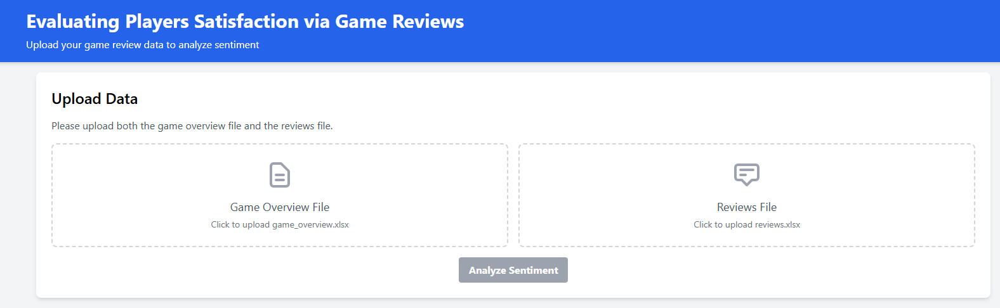

# Evaluating Players Satisfaction via Game Reviews

A Flask-based web application that uses sentiment analysis and AI to evaluate player satisfaction from game reviews. The project processes Excel files containing game overviews and user reviews, performs sentiment analysis, visualizes the results, and generates an AI-powered overview of the findings.

 <!-- Optional: Add a screenshot of your app -->

## Features

- **Dual File Upload:** Seamlessly processes separate Excel files for game overviews and user reviews.
- **Data Merging:** Intelligently merges data based on game titles to correlate reviews with game details.
- **Sentiment Analysis:** Uses TextBlob to classify reviews as Positive, Negative, or Neutral.
- **Interactive Visualizations:**
  - Sentiment distribution pie chart.
  - Polarity distribution histogram.
  - Stacked bar chart showing sentiment by game.
- **AI-Powered Insights:** Leverages the OpenRouter API to generate a detailed, narrative analysis of the sentiment data.
- **Modern UI:** Built with a clean, responsive design using Tailwind CSS and Alpine.js.

## Prerequisites

- Python 3.8+
- pip (Python package manager)
- An OpenRouter API key

## Installation and Setup

Follow these steps to get a copy of the project up and running on your local machine.

1.  **Clone the repository:**
    ```bash
    git clone https://github.com/your-username/your-repo-name.git
    cd your-repo-name
    ```

2.  **Create and activate a virtual environment:**
    - **Windows:**
      ```bash
      python -m venv venv
      .\venv\Scripts\activate
      ```
    - **macOS/Linux:**
      ```bash
      python3 -m venv venv
      source venv/bin/activate
      ```

3.  **Install the required packages:**
    ```bash
    pip install -r requirements.txt
    ```

4.  **Set up environment variables:**
    - Create a file named `.env` in the root directory of the project.
    - Add your OpenRouter API key to the `.env` file:
      ```
      OPENROUTER_API_KEY=sk-or-v1-your-actual-api-key-here
      ```

5.  **Download NLTK data:**
    - Run Python and execute the following commands:
      ```bash
      python
      >>> import nltk
      >>> nltk.download('stopwords')
      >>> nltk.download('wordnet')
      >>> exit()
      ```

## Usage

1.  **Run the Flask application:**
    ```bash
    python app.py
    ```

2.  **Open your web browser** and navigate to `http://127.0.0.1:5000`.

3.  **Upload your data:**
    - Upload the `game_overview.xlsx` file containing game details.
    - Upload the `reviews.xlsx` file containing user reviews.
    - Click the "Analyze Sentiment" button.

4.  **View the results:**
    - Explore the summary statistics and interactive charts.
    - Click the "Generate AI Analysis" button to get a detailed, AI-powered overview.

## Project Structure
game-sentiment-analysis/
├── app.py # Main Flask application and API routes
├── data/ # Directory to store uploaded files
├── static/
│ └── plots/ # Generated visualization images
├── templates/
│ └── index.html # Frontend HTML with Alpine.js and Tailwind CSS
├── utils/
│ ├── data_preprocessing.py # Functions for cleaning and preparing data
│ ├── sentiment_analysis.py # Functions for performing sentiment analysis
│ └── visualization.py # Functions for generating plots
├── .env # Environment variables (API key)
├── .gitignore # Files and directories to ignore in Git
├── requirements.txt # Python dependencies
└── README.md # This file


## Technologies Used

- **Backend:** Python, Flask, Pandas, TextBlob, NLTK, Matplotlib, Seaborn, Requests
- **Frontend:** HTML, Tailwind CSS, Alpine.js, Chart.js, Marked.js
- **AI:** OpenRouter API (Llama 3.1 model)
- **Data Processing:** Pandas, NLTK

## Contributing

Contributions are what make the open-source community such an amazing place to learn, inspire, and create. Any contributions you make are **greatly appreciated**.

1. Fork the Project
2. Create your Feature Branch (`git checkout -b feature/AmazingFeature`)
3. Commit your Changes (`git commit -m 'Add some AmazingFeature'`)
4. Push to the Branch (`git push origin feature/AmazingFeature`)
5. Open a Pull Request

## License

Distributed under the MIT License. See `LICENSE` for more information.

## Acknowledgments

- [OpenRouter](https://openrouter.ai/) for providing the AI API.
- [Flask](https://flask.palletsprojects.com/) for the web framework.
- [Tailwind CSS](https://tailwindcss.com/) for the utility-first CSS framework.
- [Alpine.js](https://alpinejs.dev/) for the lightweight and reactive JavaScript framework.

